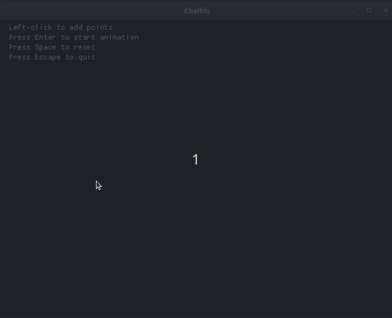

# Chaikin's Algorithm Implementation in Rust + Macroquad

A step-by-step animated implementation of Chaikin's corner-cutting subdivision algorithm for creating smooth curves from control points.

## 🎯 What is Chaikin's Algorithm?

Chaikin's algorithm is a corner-cutting subdivision technique that creates smooth curves from polygonal control points. It works by iteratively:

1. **Taking each edge** between consecutive points
2. **Creating two new points** at 25% and 75% positions along each edge  
3. **Replacing the original polygon** with these new points
4. **Repeating the process** to create increasingly smooth curves

After 7 iterations, sharp corners become beautifully smooth curves!

## 🎮 Demo

<!-- Add your GIF here -->


*Click to place control points, press Enter to watch the magic happen!*

## 🚀 Quick Start

### Prerequisites
- Rust 1.70+ installed
- Cargo package manager

### Dependencies
```toml
[dependencies]
macroquad = "0.4"
```

### Build and Run
```bash
# Clone the repository
git clone https://github.com/achnitreda/chaikin.git
cd chaikin

# Run the application
cargo run --release
```
